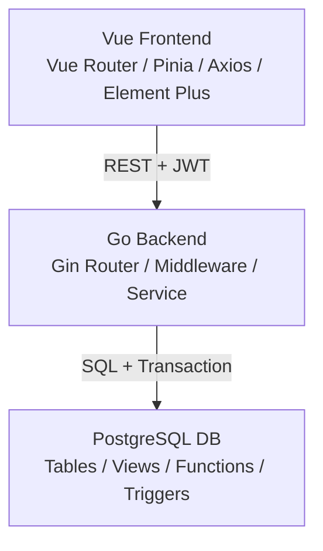
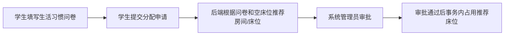
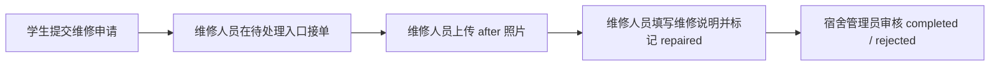
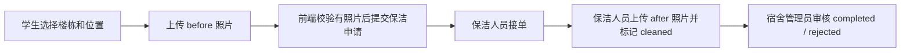
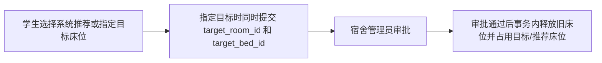
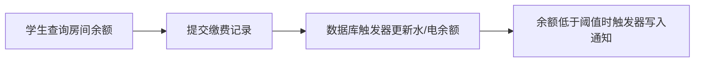
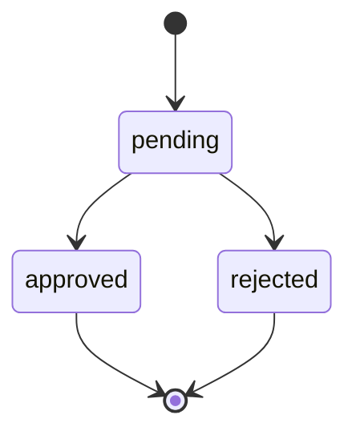
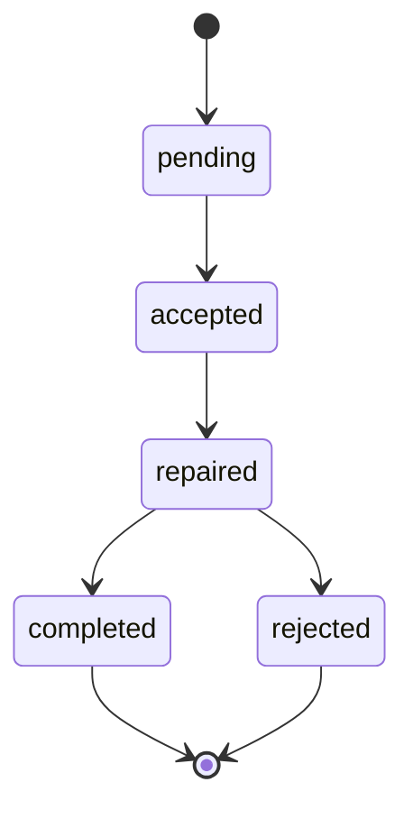
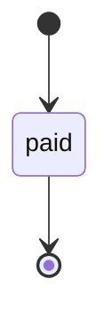

# 宿舍管理系统总体设计文档

## 1. 设计目标

宿舍管理系统采用前后端分离的 B/S 架构，目标是为学生、维修人员、保洁人员、宿舍管理员和系统管理员提供统一的住宿业务平台。系统强调：

- 角色清晰：不同用户只看到与职责相关的入口和操作。
- 流程闭环：申请、接单、上传图片、审批、完成、通知均可追踪。
- 数据一致：床位占用、水电余额、工单状态等关键变化由后端事务和数据库触发器共同保障。
- 接口规范：前端严格对接后端 REST API，不虚构接口，不硬编码当前用户 ID。
- 可维护：前端、后端、数据库分层明确，业务模块按领域组织。

## 2. 总体架构



### 前端职责

- 提供登录页、角色工作台、业务表单、审批页面、统计页面和附件图片交互。
- 使用 Vue Router 做页面路由和权限守卫。
- 使用 Pinia 保存登录态、当前用户和通知数据。
- 使用 Axios 统一注入 token、处理 401 自动刷新和错误提示。
- 使用 Element Plus 构建后台管理风格界面。
- 使用 ECharts 展示楼栋床位统计。

### 后端职责

- 提供 `/api` 下的 REST 接口。
- 通过 JWT 完成认证，通过角色中间件完成粗粒度权限控制。
- 在 Service 层完成业务校验、资源级权限校验、状态流转和事务编排。
- 通过 sqlx + pgx 访问 PostgreSQL。
- 统一返回 JSON 响应和错误信息。

### 数据库职责

- 保存用户、楼栋、房间、床位、申请、工单、通知、缴费和附件数据。
- 通过视图提供常用查询，如我的申请、空床位、舍友、待处理工单、楼栋统计和低余额房间。
- 通过触发器维护状态时间戳、床位一致性、低余额通知和缴费后余额更新。
- 使用 `BYTEA` 统一存储图片二进制。

## 3. 目录与模块

```text
backend/
  cmd/server        服务启动入口
  config            配置文件
  docs/API.md       REST API 文档
  internal          路由、处理器、服务、模型等后端实现

frontend/
  src/api           REST API 封装
  src/components    通用组件
  src/router        路由和权限守卫
  src/stores        Pinia 状态
  src/types         TypeScript 类型
  src/utils         工具函数
  src/views         页面

sql/
  001_create...     表、视图、函数、触发器
  002_seed...       测试数据
  003_truncate...   清空数据脚本
```

## 4. 核心业务域

| 业务域 | 主要能力 |
| --- | --- |
| 认证与用户 | 登录、登出、刷新 token、创建用户、获取当前用户 |
| 宿舍基础数据 | 楼栋、房间、床位、空床位、舍友信息 |
| 新生分配 | 学生发起分配申请，系统推荐床位，管理员审批后占用床位 |
| 生活习惯问卷 | 学生提交睡眠、吸烟、打鼾、学习习惯等信息，供分配推荐参考 |
| 学生申请 | 离校、晚归、换寝、校外居住申请 |
| 维修工单 | 学生提交，维修人员接单并上传后照片，宿管审核 |
| 保洁工单 | 学生提交并上传前照片，保洁人员接单并上传后照片，宿管审核 |
| 水电缴费 | 学生查询房间余额并缴费，数据库触发器更新余额 |
| 通知 | 查询通知、标记已读、低余额自动通知 |
| 附件 | 图片上传、元数据查询、blob 预览 |
| 统计 | 楼栋床位汇总、低余额房间 |

## 5. 角色权限设计

| 角色 | 前端入口 | 后端权限范围 |
| --- | --- | --- |
| 学生 | `/student/*` | 当前用户个人信息、个人申请、本人宿舍相关查询和提交 |
| 维修人员 | `/repair/*` | 待接维修工单、本人已接维修工单、维修完成 |
| 保洁人员 | `/cleaning/*` | 待接保洁工单、本人已接保洁工单、清洁完成 |
| 宿舍管理员 | `/manager/*` | 待审批申请、全部/待审核工单、统计和低余额 |
| 系统管理员 | `/admin/*` | 用户创建、新生分配审批、统计和低余额 |

前端路由通过 `meta.roles` 声明允许角色。后端通过中间件验证登录和角色，涉及资源归属的判断在 Service 层再次校验。

## 6. 认证与会话设计

认证基于 access token 和 refresh token：

1. 用户调用 `POST /auth/login`。
2. 后端校验用户名和密码，返回两个 token。
3. 前端保存 token，并在每个业务请求中注入 `Authorization`。
4. access token 过期时，前端调用 `POST /auth/refresh`。
5. refresh token 每次刷新后旧 token 失效，前端必须替换本地 token。
6. 多个请求同时遇到 `401` 时，前端共享同一个 refresh Promise，避免重复刷新。
7. refresh 失败或登出时清空登录态并回到登录页。

登录失败或账号不存在时，前端统一提示“账号和密码错误”。

## 7. 关键流程

### 7.1 新生分配



前端会根据当前用户的 `has_survey` 和 `has_bed` 控制菜单入口：已填问卷不再显示生活习惯入口，已有床位不再显示分配申请入口。

### 7.2 维修工单



学生提交维修申请时，前端从当前用户宿舍信息自动补齐 `room_id`，不要求学生手动填写房间 ID。

### 7.3 保洁工单



保洁申请在创建前必须选择图片；创建成功后立即将图片上传并绑定到该工单。

### 7.4 换寝申请



### 7.5 水电缴费与低余额通知



## 8. 状态流转

### 通用申请



适用于离校、晚归、换寝、校外居住、新生分配等审批类业务。

### 维修工单



### 保洁工单


### 缴费记录



前端统一使用 `StatusTag` 展示状态：`pending` 为 warning，`approved/completed/paid` 为 success，`rejected` 为 danger，`accepted/repaired/cleaned` 为 primary。

## 9. 附件设计

图片统一存入 `attachments` 表：

| 业务对象 | owner_type | category |
| --- | --- | --- |
| 用户头像 | `user_avatar` | `avatar` |
| 维修后照片 | `repair` | `after` |
| 保洁前照片 | `cleaning` | `before` |
| 保洁后照片 | `cleaning` | `after` |

前端封装三个组件：

- `ImageUploader`：上传 jpg/png，最大 5MB，成功后发出 `success` 事件。
- `AttachmentImage`：通过 blob 加载图片，支持加载和错误状态。
- `AttachmentList`：查询附件元数据并预览图片；没有照片时显示“无照片”。

后端附件下载返回二进制流和正确的 `Content-Type`。列表接口返回元数据，避免直接读取大字段。

## 10. 数据一致性设计

系统将一致性规则放在两个层级：

- 后端 Service：负责参数校验、权限校验、状态前置条件、跨表事务。
- PostgreSQL：负责触发器和约束，如床位占用一致性、状态时间戳、缴费更新余额、低余额通知。

关键变更如分配床位、换寝、校外居住、缴费和审批均应在事务中完成。

## 11. 前端交互设计

前端定位为现代后台管理系统，不提供营销首页。主要交互原则：

- 登录后直接进入角色工作台。
- 左侧菜单按角色和用户状态动态显示。
- 顶部用户栏展示当前用户和退出登录入口。
- 表格用于列表，表单用于创建和审批，Tag 用于状态，弹窗用于确认危险操作。
- 所有创建、审批、接单、完成操作成功后刷新对应列表。
- 后端错误统一通过 Element Plus Message 展示 `message`。
- 日期展示使用本地格式，提交给后端使用 ISO 8601。

## 12. 部署与运行设计

开发环境：

- 后端监听 `http://localhost:8080`。
- 前端监听 `http://localhost:5173`。
- 前端 Vite 代理 `/api` 到后端。

生产环境：

- 后端通过环境变量覆盖数据库、端口和 JWT 密钥。
- 前端执行 `npm run build` 输出 `dist/`。
- 静态资源服务器需要支持 Vue Router history 模式，将未知路径回退到 `index.html`。
- API 地址可通过 `VITE_API_BASE_URL` 配置。

## 13. 可扩展方向

- 增加分页、筛选和导出能力，优化大数据量列表。
- 引入 WebSocket 或 Server-Sent Events 推送通知。
- 将附件扩展为对象存储，数据库仅保留元数据。
- 补充端到端测试，覆盖登录、申请、审批和工单闭环。
- 增加操作审计日志，记录关键状态变更。
