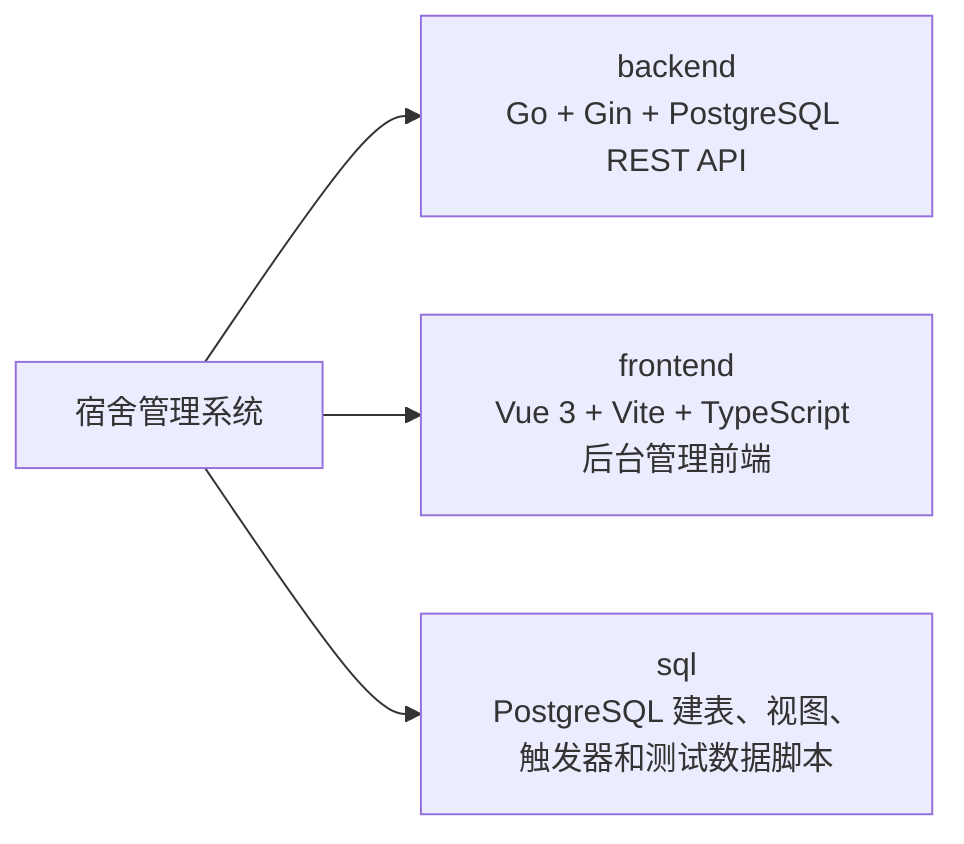

# 宿舍管理系统

这是一个前后端分离的宿舍管理系统，覆盖学生住宿申请、宿舍分配、离校/晚归/换寝/校外居住审批、维修与保洁工单、水电缴费、通知、附件图片和楼栋统计等业务。

## 项目组成



各模块详细说明：

- 后端说明：[backend/README.md](backend/README.md)
- 后端设计：[backend/DESIGN.md](backend/DESIGN.md)
- 前端说明：[frontend/README.md](frontend/README.md)
- 前端设计：[frontend/DESIGN.md](frontend/DESIGN.md)
- 数据库说明：[sql/README.md](sql/README.md)
- 数据库设计：[sql/DESIGN.md](sql/DESIGN.md)
- API 文档：[backend/docs/API.md](backend/docs/API.md)

## 技术栈

| 层级 | 技术 |
| --- | --- |
| 前端 | Vue 3、Vite、TypeScript、Vue Router、Pinia、Axios、Element Plus、ECharts |
| 后端 | Go、Gin、sqlx、pgx、JWT、bcrypt、Viper、Zap |
| 数据库 | PostgreSQL 12+、视图、函数、触发器、BYTEA 附件存储 |

## 核心角色

| 角色 | 标识 | 主要职责 |
| --- | --- | --- |
| 学生 | `student` | 填写问卷、申请分配/离校/晚归/换寝/校外居住/维修/保洁、缴费、查看通知和工单 |
| 维修人员 | `repair_staff` | 接收维修工单、上传维修后照片、完成维修 |
| 保洁人员 | `cleaning_staff` | 接收保洁工单、上传保洁后照片、完成清洁 |
| 宿舍管理员 | `dormitory_manager` | 审批学生申请，审核维修/保洁工单，查看统计和低余额房间 |
| 系统管理员 | `system_admin` | 创建用户，审批新生分配，查看统计和低余额房间 |

## 快速启动

### 1. 初始化数据库

先确保本机已有 PostgreSQL 数据库：

```sql
CREATE DATABASE student_dormitory OWNER admin;
```

在项目根目录执行：

```bash
PGPASSWORD=passwd psql -U admin -d student_dormitory -f sql/001_create_student_dormitory_schema.sql
PGPASSWORD=passwd psql -U admin -d student_dormitory -f sql/002_seed_student_dormitory_test_data.sql
```

如需验证自动舍友/床位推荐算法，可额外插入专项测试数据：

```bash
PGPASSWORD=passwd psql -U admin -d student_dormitory -f sql/004_seed_roommate_recommendation_test_data.sql
```

随后使用 `student101` 登录并提交分配申请，预期推荐 `自动推荐测试楼 701 C床`。

如需清空业务数据并重置自增序列：

```bash
PGPASSWORD=passwd psql -U admin -d student_dormitory -f sql/003_truncate_student_dormitory_data.sql
```

### 2. 启动后端

```bash
cd backend
DORM_JWT_SECRET='e671eb179af89abbd4bb1e264799e47a3888bc5ac10d13add8e24d2a4cc3ed15' go run ./cmd/server
```

后端默认监听：

```text
http://localhost:8080
```

健康检查：

```bash
curl http://localhost:8080/api/health
```

### 3. 启动前端

```bash
cd frontend
npm install
npm run dev
```

前端默认监听：

```text
http://localhost:5173/
```

开发环境下前端通过 Vite 代理访问后端 `/api`。如需覆盖接口地址，可设置：

```bash
VITE_API_BASE_URL=http://localhost:8080/api npm run dev
```

## 测试账号

测试数据脚本提供以下账号，密码均为 `123456`：

| 用户名 | 角色 |
| --- | --- |
| `admin001` | 系统管理员 |
| `manager001` | 宿舍管理员 |
| `repair001` | 维修人员 |
| `cleaner001` | 保洁人员 |
| `student001` - `student008` | 学生 |
| `student101` - `student106` | 自动舍友推荐专项测试学生 |

## 常用命令

后端测试：

```bash
cd backend
go test ./...
```

前端构建：

```bash
cd frontend
npm run build
```

前端预览构建产物：

```bash
cd frontend
npm run preview
```

## API 与认证

API 基础路径：

```text
http://localhost:8080/api
```

认证流程：

1. `POST /auth/login` 登录，返回 `access_token` 和 `refresh_token`。
2. 前端请求自动携带 `Authorization: Bearer <access_token>`。
3. 业务接口返回 `401` 时，前端使用 `POST /auth/refresh` 刷新 token。
4. refresh 成功后替换本地 token 并重试原请求。
5. refresh 失败则清空登录态并跳转登录页。

完整接口字段、权限和响应格式以 [backend/docs/API.md](backend/docs/API.md) 为准。

## 业务入口

登录后系统会调用 `GET /students/me` 获取当前用户信息，并按角色跳转：

| 角色 | 默认入口 |
| --- | --- |
| `student` | `/student/dashboard` |
| `repair_staff` | `/repair/dashboard` |
| `cleaning_staff` | `/cleaning/dashboard` |
| `dormitory_manager` | `/manager/dashboard` |
| `system_admin` | `/admin/dashboard` |

前端菜单会按角色动态展示。学生已填写生活习惯问卷后不再显示问卷入口；已有床位后不再显示新生分配申请入口。

## 附件图片

系统图片统一通过附件接口处理：

- `POST /attachments` 上传，使用 `multipart/form-data`
- `GET /attachments/{id}` 以 blob 获取图片
- `GET /attachments?owner_type=...&owner_id=...&category=...` 查询附件元数据

数据库使用 `attachments.file_data BYTEA` 存储图片二进制。前端限制仅允许 `jpg/png`，最大 `5MB`。

## 文档维护

当接口字段、权限、状态流转或数据库结构发生变化时，请同步更新：

1. [backend/docs/API.md](backend/docs/API.md)
2. 对应模块 README 或 DESIGN
3. 根目录 [README.md](README.md) 与 [DESIGN.md](DESIGN.md) 中受影响的总体说明
